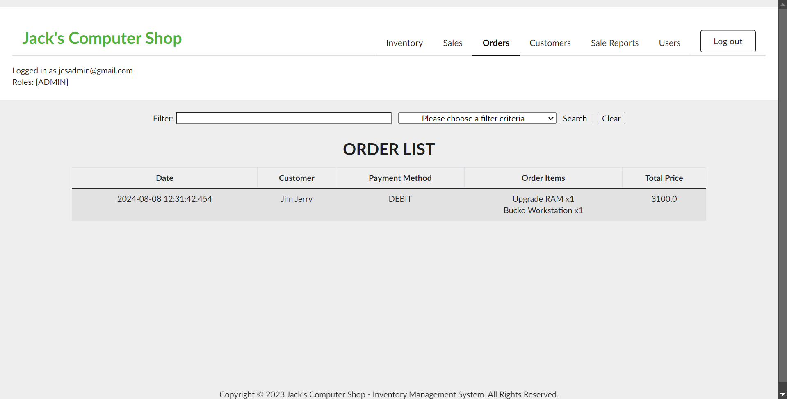

# **D424_ Software Engineering Capstone Project**

**Quang Pham** 

**Student ID: 011025265**

**Jack's Computer Shop (JCS) - Inventory Management System**

- Full stack web application that allows users to manage stock supplies across multiple stores through a centralized web portal and database.
- Support user authentication with Oauth, Spring Security, and user authorization with RBAC architecture.

## **ENVIRONMENT SETUP**

Recommended IDE: 
    
    IntelliJ IDEA

Database:
    
    Postgres
    Port: 5433
    Database name: d287
    Database user: postgres
    Database password: postgres
 
>If using your own database config, please update these variables in **application.properties**

## **STARTING THE SERVER**

1. Clone the repo
2. Configure the database
3. Click Run/ Press Shift+F10 (IntelliJ IDEA)

    

> Access the server at http://localhost:8080

## **SIGN IN**

#### To sign in as ADMIN:

- Email: jcsadmin@gmail.com
- Password: jcsadmin

#### To sign in as USER:

- Email: jcsuser@gmail.com
- Password: jcsuser

## **PREVIEW AS ADMIN**

#### Inventory

- ADMIN can view/add/update/delete parts, products, and services.
- ADMIN can associate parts to products, thereby increasing a product quantity will decrease the constituent parts by corresponding amount.
- ADMIN can add products and services to sales.

#### Sales

- ADMIN can complete sales.

#### Orders
    
- ADMIN can view details of completed sales.

#### Customers

- ADMIN can view/update/delete customer profiles.

#### Reports

- ADMIN can view tracking reports of completed sales for accountability tracking.

#### Users

- ADMIN can view/update/delete users.

## **PREVIEW AS USER**

#### Inventory

- USER can view products and services.
- USER can add products and services to sales.

#### Sales

- USER can complete sales.

#### Orders

- USER can view details of completed sales.

#### Customers

- USER can view/add/update/delete customer profiles.

